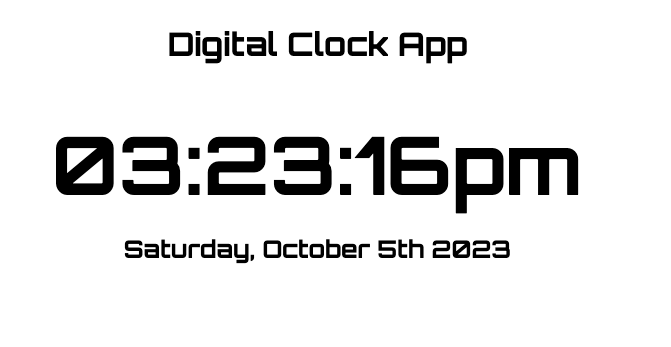

# Digital Clock App

*A digital clock app written in HTML, CSS and Vanilla JS*

View it [here](https://jsclampet.github.io/clockapp-sdmm-third-assignment/)

## Summary 

- Displays the time in CST

## Author

- John Clampet: FullStack Software Developer
- [LinkedIn](https://www.linkedin.com/in/john-clampet-264007122/)